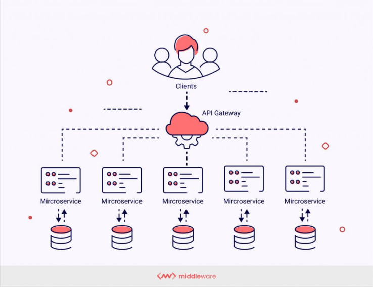

### What is 3 Tier Architecture??
**3 tier architecture is that architecture which built on microservices. Microservices is an architectural style that structures an application as a collection of small, independent, and loosely coupled services. Each service is designed to perform a specific business function and can be developed, deployed, and scaled independently.**

### Flow
**1. Frontend: It will deployed on serverless service like s3 bucket using tech stack like Anguler, Java, HTML, CSS.**

**2. Backend: It wiil deployed on EKS cluster using teck stack Springboot Java.**

**3. Database: It will deployed on RDS service using database engine like Postgres.**

### Create Infrastructure using Terraform
**Using Terraform create 1. EKS clsuter 2. S3 bucket  3. RDS**